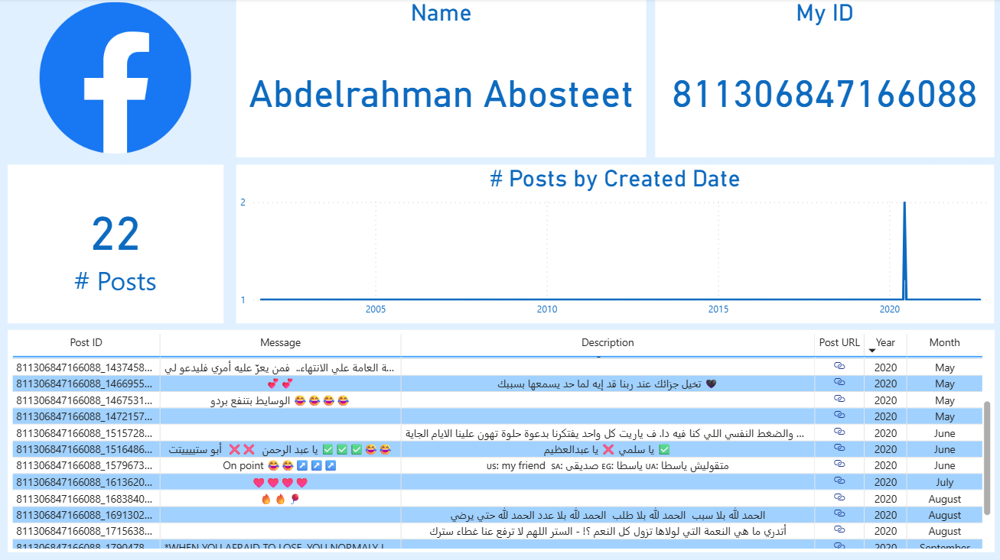

# My Facebook Account Dashboard 📊

> A personal Facebook analytics dashboard that extracts real-time post data via the Facebook Graph API and visualizes it in Power BI with a clean, mobile-responsive layout.

---

## 📌 Overview

This dashboard was built to analyze personal Facebook account activity by connecting directly to the Facebook Graph API. It transforms raw post data into meaningful visual insights, allowing exploration of posting patterns over time, post content, and direct navigation to individual posts through clickable URL icons.

---

## 🖼️ Dashboard Preview



---

## 🔍 Key Insights

- Total of **22 posts** retrieved from the personal Facebook account via the Graph API
- Posting activity is concentrated around **2020**, with a clear spike visible in the timeline chart
- Posts span multiple years, revealing long gaps in activity followed by bursts of engagement
- The post details table includes full message content, description, year, month, and a direct **clickable icon** linking to each post URL
- Mobile layout ensures the dashboard is fully usable on smaller screens

---

## ⚙️ Power Query Steps Applied

- Renamed query and all column names for clarity
- Changed data types to match each field (date, text, number)
- Extracted post links from raw API response
- Extracted hashtags from post message content
- Added post URL column to the data model

---

## 📐 DAX Measures

| Measure | Description |
|---------|-------------|
| `# Posts` | Total number of posts using `COUNTROWS` |

---

## 🔧 Advanced Features

- **Mobile Layout:** Optimized responsive view built inside Power BI Desktop for smaller screens
- **Clickable Post URLs:** Post URL column transformed into a clickable icon in the table visual for direct navigation

---

## 🛠️ Tools and Techniques

| Tool | Usage |
|------|-------|
| **Power BI Desktop** | Dashboard design, data modeling, DAX measures |
| **Facebook Graph API v17.0** | Real-time data extraction via Web connector |
| **Power Query** | Column renaming, data type changes, link and hashtag extraction |
| **DAX** | Custom `# Posts` measure |
| **Power BI Report Server** | On-premises publishing and deployment |

**Visualizations used:** KPI card, Line chart, Table with clickable URL icons

---

## 🔌 Data Source

Data was extracted in real-time from a personal Facebook account using the Facebook Graph API v17.0, authenticated via access token and connected directly to Power BI through the Web connector.

**Fields extracted:** `id`, `name`, `posts` (including `created_time`, `message`, `description`)

**API Endpoint used:**
```
https://graph.facebook.com/v17.0/me?fields=id,name,posts{created_time,message,description}
```
